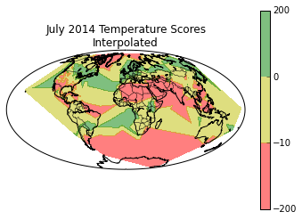
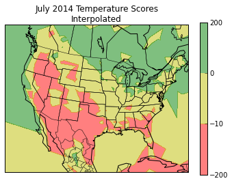

# Nice Weather
### by Kenny Taliaferro

### Summary
This project is designed to help travelers find a destination with nice weather.

### User Input

* A month
* A desired temperature range (minimum desired low and maximum desired high)
* A desired longitude and latitude range (optional, default is the entire globe)

### Program Output
A map with shaded regions that indicate how nice the weather is.

* The green region is in the desired temperature range
* The yellow region is within 10 degrees of the desired temperature range
* The red region is not within 10 degrees of the desired temperature range

### Data
The data consists of daily weather readings that were taken from roughly 10,000 weather stations around the world in 2014.  We take a random sample of 1,000 of these stations and use linear interpolation to determine the weather at all points on the globe.  <a href="ftp://ftp.ncdc.noaa.gov/pub/data/gsod">ftp://ftp.ncdc.noaa.gov/pub/data/gsod</a>
